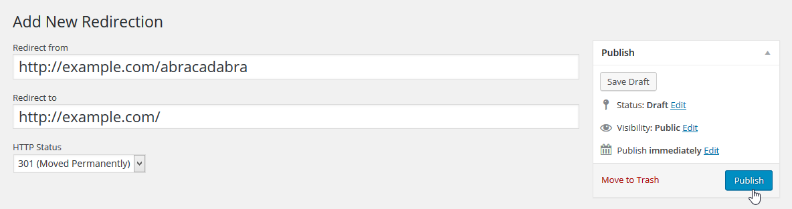
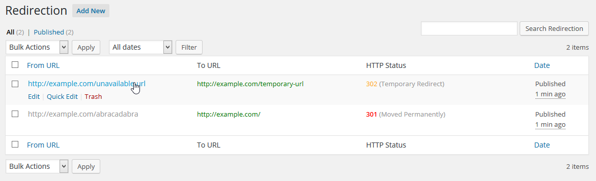

NanoRedirection
===

Contributors: nanodesigns
Tags: redirection, http redirection, wordpress redirection
Requires at least: 3.0
Tested up to: 4.4.2
Stable tag: 1.0.0
License: GPL-2.0+
License URI: http://www.gnu.org/licenses/gpl-2.0.txt

Create a native, easy-to-use redirection being in WordPress database schema that works in single site and multisite instances.

## Description
Create a native, easy-to-use redirection being in WordPress database schema that works in single site and multisite instances

## Installation
The plugin is simple to install:

1. Download the latest release of NanoRedirection plugin as `.zip` file
2. Unzip and upload the `nano-redirection` directory to your `/wp-content/plugins` directory using FTP or File manager
3. Go to the plugin management page and enable the plugin
4. Find the menu under `Tools` menu and create necessary redirections

## Frequently Asked Questions
**Q. Where is the menu?**
**A.** The `Redirection` menu is under `Tools` menu in admin panel.

## Screenshots
<br>
_NanoRedirection - redirection creation panel_

<br>
_NanoRedirection - list of redirections_

## API
You can use this plugin for your plugin or theme to make necessary redirection automatically. Just use the following function where necessary. It will function upon activation of the plugin and will redirect as per your choice:

````
nr_create_redirection( $from_url, $to_url, $status );
````

<small>

* `$from_url`: From which URL you want to redirect the user
* `$to_url`: To which URL you want to redirect the user to
* `$status`: The HTTP status code, whether `301` (Moved permanently) or `302` (Temporary Redirect). Default: `301`.

</small>

## Change log
### 1.0.0

* The plugin initiated
* WordPress database schema
* No other database
* Works on WordPress Multisite too

____
[**nano**designs](http://nanodesignsbd.com)